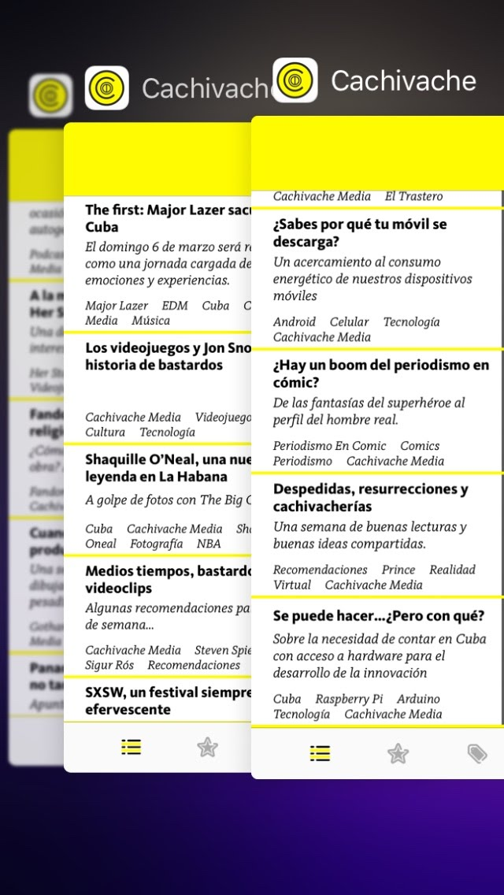
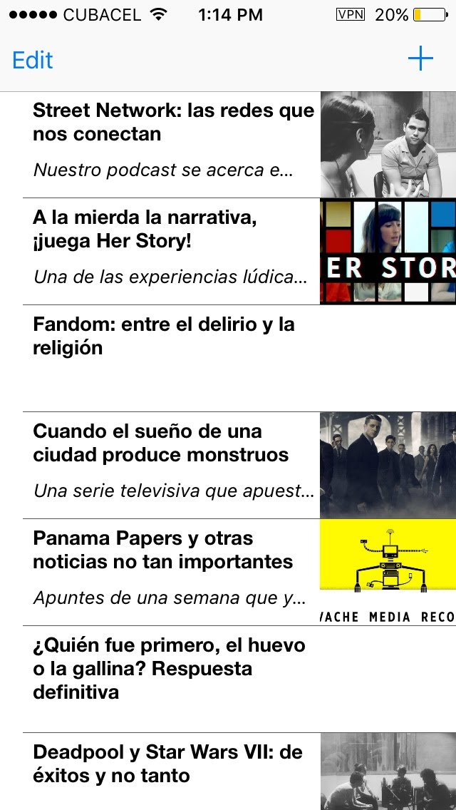
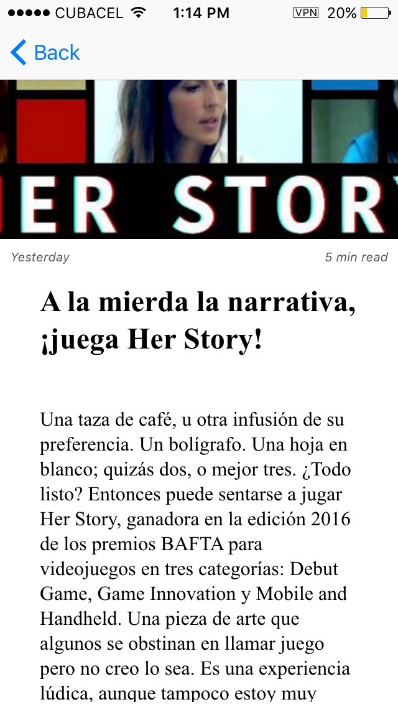
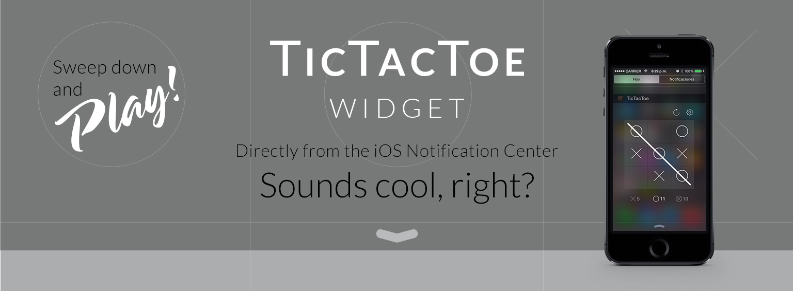
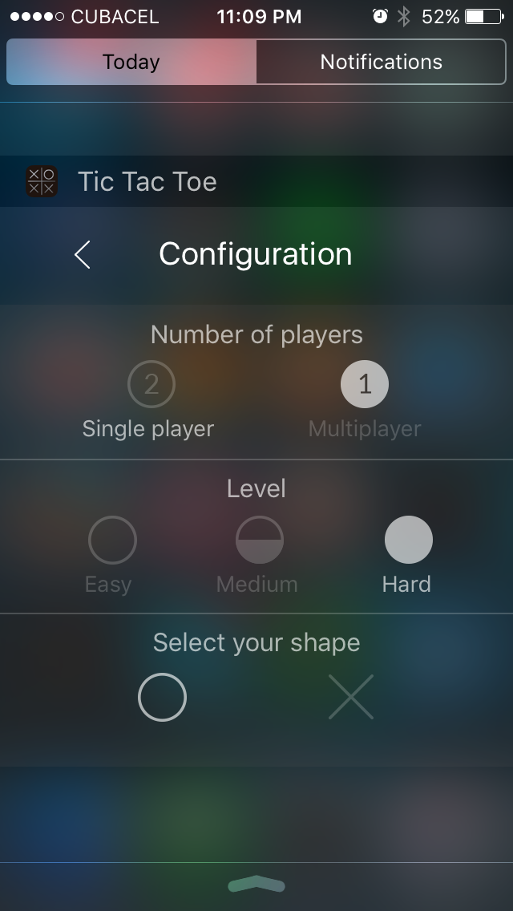
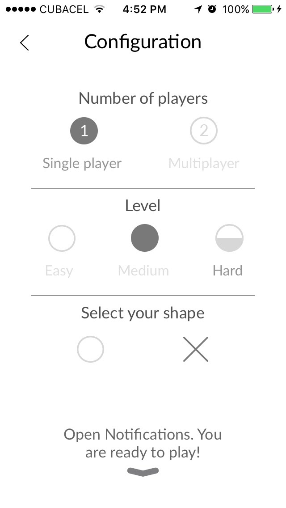

[//]: # "Badges"

[![curriculum vitae][badge_downloadcv]][downloadCV]
[![email][badge_mailTo]][mailTo]
[![linkedIn][badge_linkedIn]][linkedIn]
[![twitter][badge_twiiter]][twiiter]
[![stackoverflow][badge_stackoverflow]][stackoverflow]

[//]: # "About me"

# Hugo Alonso Luis

Hi!,
A *happy human* that loves being a `coder` over here!

I'm always eager to improve my skills and explore other points of view. I started to code in **Delphi**, **C++** & **Java**, after several languages and technologies.., I'm now comfortably using **Swift** for creating iOS apps. 

I'm really curious, so I like to get a grasp of almost every disruptive technology... I guess I'm kind of a technological polygamist 😅. 

Oh.. **I enjoy teaching**, I have been a 👨🏻‍🏫 for several years and through StackOverflow, I have had the opportunity to continue when not in the classroom.

✌🏻

# Marvel Characters

[Marvel Characters](https://gitlab.com/hugoalonsoluis/marvel-characters) is a take-home project I completed as part of the interview process for an iOS Developer role in Portugal.

The prototype/design was provided as a [Marvel Prototype](https://marvelapp.com/279b309/screen/10499832). The main idea was to present data from the [Marvel API](https://developer.marvel.com).

<!-- Portfolio Gallery Grid -->

## My contribution

I created a complete functional version in approximately 14 days using Swift 3, [RxSwift](https://github.com/ReactiveX/RxSwift) and Storyboards. It uses [Alamofire](https://github.com/Alamofire/Alamofire) for networking and [KingFisher](https://github.com/onevcat/Kingfisher) for caching of images. For handling dependencies it was used [Carthage](https://github.com/Carthage/Carthage).

This was the first time I used blur effects and custom transitions in an app, and I ❤️it!

Later on, I started experimenting with it and it has been my playground for testing and Continuous Integration using [GitlabCI](https://about.gitlab.com/product/continuous-integration/). Currently is updated to Swift 5.

## Links to the project

- Gitlab (original) -> [https://gitlab.com/hugoalonsoluis/marvel-characters](https://gitlab.com/hugoalonsoluis/marvel-characters)
- Github -> [https://github.com/halonsoluis/marvel-characters](https://github.com/halonsoluis/marvel-characters)

# Cachivache

[Cachivache](https://gitlab.com/hugoalonsoluis/Cachivache) description

<!-- Portfolio Gallery Grid -->

## My contribution

ahsgfkasgf

## Links to the project

- Gitlab (original) -> [https://gitlab.com/hugoalonsoluis/marvel-characters](https://gitlab.com/hugoalonsoluis/marvel-characters)
- Github -> [https://github.com/halonsoluis/marvel-characters](https://github.com/halonsoluis/marvel-characters)

# Tic Tac Toe Widget Edition

description...

<!-- Portfolio Gallery Grid -->

## My contribution

My contribution on tic tac toe

## Links to the project

- Landing Page design -> [https://www.behance.net/gallery/27651605/TicTacToe-Widget](https://www.behance.net/gallery/27651605/TicTacToe-Widget)
- Product Hunt -> [https://www.producthunt.com/posts/tictactoe-widget-edition](https://www.producthunt.com/posts/tictactoe-widget-edition)
- AppAdvice -> [https://appadvice.com/app/tictactoe-widget-edition/966408407](https://appadvice.com/app/tictactoe-widget-edition/966408407)

# Meryl Collections

description...

<!-- Portfolio Gallery Grid -->

## My contribution

My contribution on Meryl Collections

## Links to the project

- Landing Page design -> [https://www.behance.net/gallery/27643619/Meryl-App-for-iOS](https://www.behance.net/gallery/27643619/Meryl-App-for-iOS)
- Product Hunt -> [https://www.producthunt.com/posts/tictactoe-widget-edition](https://www.producthunt.com/posts/tictactoe-widget-edition)
- AppAdvice -> [https://appadvice.com/app/tictactoe-widget-edition/966408407](https://appadvice.com/app/tictactoe-widget-edition/966408407)

[//]: # "Badges"

[badge_carthage]: https://img.shields.io/badge/Dependency_Injection-Carthage-blue.svg?style=for-the-badge&logoColor=white
[badge_downloadCV]: https://img.shields.io/badge/Download_CV-black.svg?style=for-the-badge&logo=adobe&logoColor=white
[badge_mailTo]: https://img.shields.io/badge/Email-black.svg?style=for-the-badge&logo=minutemailer&logoColor=white
[badge_stackoverflow]: https://img.shields.io/badge/stackoverflow-black.svg?style=for-the-badge&logo=stackoverflow&logoColor=white
[badge_linkedIn]: https://img.shields.io/badge/linkedin-black.svg?style=for-the-badge&logo=linkedin&logoColor=white
[badge_twiiter]: https://img.shields.io/badge/twitter-black.svg?style=for-the-badge&logo=twitter&logoColor=white

[//]: # "Links"

[downloadCV]: /files/cv.pdf
[mailTo]: mailto:hugoalonsoluis@gmail.com
[stackoverflow]: https://stackoverflow.com/story/hugo-alonso-luis
[linkedIn]: https://www.linkedin.com/in/hugoalonsoluis/?locale=en_US
[twiiter]: https://twitter.com/hugoalonsoluis