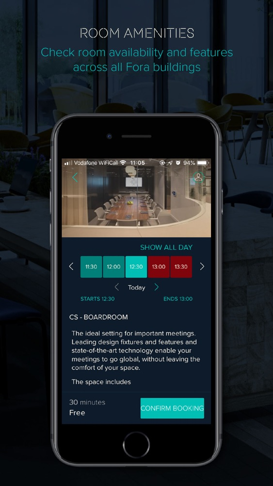

[//]: # "Badges"

[![curriculum vitae][badge_downloadcv]][downloadCV]
[![email][badge_mailTo]][mailTo]
[![linkedIn][badge_linkedIn]][linkedIn]
[![twitter][badge_twiiter]][twiiter]
[![stackoverflow][badge_stackoverflow]][stackoverflow]

[//]: # "About me"

# Hugo Alonso Luis

Hi!,
A *happy human* that loves being a `coder` over here!

I'm always eager to improve my skills and explore other points of view. I started to code in **Delphi**, **C++** & **Java**, after several languages and technologies.., I'm now comfortably using **Swift** for creating iOS apps. 

I'm really curious, so I like to get a grasp of almost every disruptive technology... I guess I'm kind of a technological polygamist 😅. 

Oh.. **I enjoy teaching**, I have been a 👨🏻‍🏫 for several years and through StackOverflow, I have had the opportunity to continue when not in the classroom.

✌🏻

# Fora

Fora is a 'proworking' App - Exclusive to FORA members and allows them to be constantly connected. It connects the user to their FORA concierge, other residents, allows to book meeting rooms and receive live travel updates.

<!-- Portfolio Gallery Grid -->

## My contribution

I was part of the initial team working on the creation of all the online presence of FORA (Android, iOS, Web, Backend). 

My role, as part of a team of 4 iOS developers, was to create the Minimum Viable Product.
Our team work and motivation resulted on achieving the goals in record time and retain an important client.

## Links to the project

- [Fora on the Appstore](https://apps.apple.com/es/app/fora/id1160810227)

# Marvel Characters

[Marvel Characters](https://gitlab.com/hugoalonsoluis/marvel-characters) is a take-home project I completed as part of the interview process for an iOS Developer role in Portugal.

The prototype/design was provided as a [Marvel Prototype](https://marvelapp.com/279b309/screen/10499832). The main idea was to present data from the [Marvel API](https://developer.marvel.com).

<!-- Portfolio Gallery Grid -->

## My contribution

I created a complete functional version in approximately 14 days using Swift 3, [RxSwift](https://github.com/ReactiveX/RxSwift) and Storyboards. It uses [Alamofire](https://github.com/Alamofire/Alamofire) for networking and [KingFisher](https://github.com/onevcat/Kingfisher) for caching of images. For handling dependencies it was used [Carthage](https://github.com/Carthage/Carthage).

This was the first time I used blur effects and custom transitions in an app, and I ❤️it!

Later on, I started experimenting with it and it has been my playground for testing and Continuous Integration using [GitlabCI](https://about.gitlab.com/product/continuous-integration/). Currently is updated to Swift 5.

## Links to the project

- [Gitlab link to the project (original)](https://gitlab.com/hugoalonsoluis/marvel-characters)
- [Github link to the project](https://github.com/halonsoluis/marvel-characters)

# Cachivache

[Cachivache](https://gitlab.com/hugoalonsoluis/Cachivache) was a project for allowing to download and visualize the contents of an independent, young and energetic publication startup dealing with the challenges that suppose the lack of connnectivity in Cuba.

Main goal being to be able to bring offline access to all the posts made by their publication (cachivachemedia.com)
It's some sort of a Pocket, but exclusively for them and having special consideration for offline use.

It allowed to:

- Favorite, download and visualize posts.
- Set, edit and filter by tags.
- Analytics across the app.

<!-- Portfolio Gallery Grid -->

## My contribution

For this project I was the solo-developer. The app was in the AppStore until the publication decided to stop their project.

Among the main challenges:
- Download the content from the posts from Medium (where the publication is hosted)
- Provide a customizable and reliable offline experience.
- Guarantee that all the content is downloaded as fast as possible while connected to the internet (as in Cuba the internet is slow and limited/expensive in time)

## Links to the project

- [Gitlab link to the project](https://gitlab.com/hugoalonsoluis/Cachivache)
- [CachivacheMedia](https://cachivachemedia.com)
- [Old link to the app in the AppStore](https://itunes.apple.com/us/app/id1150154493)

# Tic Tac Toe Widget Edition

Tic Tac Toe Widget Edition allowed the user to play Tic Tac Toe directly from the iOS Notification Center and the Apple Watch.

• Single player mode against an AI including 3 levels of difficulty

• Multiplayer mode (Human vs Human in the same device)

• Persistence of the statistics and state of the game when dismissing the Notification Center.

<!-- Portfolio Gallery Grid -->

## My contribution

This app was created in the following months of the release of the widgets and apple watch APIs from Apple.

The most challenging part of the development was the need to explore the limitants of the Widgets environment and discover & fix undocumented memory issues.

From here that the app had to be rebuilt 3 times before we could publish it in the AppStore. Our standards about quality were high, and we couldn't allow an app that would close itself in unexpected moments.

I can't denied that it was super fun and challenging to create. I was the leading a team of 4 iOS developers working on the app from concept to the AppStore.

## Links to the project

- [Landing Page design](https://www.behance.net/gallery/27651605/TicTacToe-Widget)
- [Product Hunt](https://www.producthunt.com/posts/tictactoe-widget-edition)
- [AppAdvice](https://appadvice.com/app/tictactoe-widget-edition/966408407)

# Nylstar Collections

An app for the showcase of the **Collections Store** of Meryl.

With the app a user could discover the latest fashion collections made with Meryl.

<!-- Portfolio Gallery Grid -->

## My contribution

This was my first project as an iOS Developer. I was part of a team of 4 highly motivated guys craving for knowledge and excited about Swift.

We built the app from scratch and many of it's following iterations once it was published in the AppStore. The work made demanded a lot of comunication, collaboration and iterations in design.

## Links to the project

- [Landing Page design](https://www.behance.net/gallery/27643619/Meryl-App-for-iOS)
- [AppAdvice](https://appadvice.com/app/nylstar-collections/989465882)

# Other projects not yet added:
- [BeatTune Meaningful heart rate](https://www.producthunt.com/posts/beattune-meaningful-heart-rate)
- [Coris Asis](https://appadvice.com/app/corisasis/1062706925)
- [WIND VISION](https://apps.apple.com/ao/app/wind-vision/id1373255885)
- [A1 Xplore TV GO](https://apps.apple.com/bg/app/a1-xplore-tv-go/id1460357508)

[//]: # "Badges"

[badge_carthage]: https://img.shields.io/badge/Dependency_Injection-Carthage-blue.svg?style=for-the-badge&logoColor=white
[badge_downloadCV]: https://img.shields.io/badge/Download_CV-black.svg?style=for-the-badge&logo=adobe&logoColor=white
[badge_mailTo]: https://img.shields.io/badge/Email-black.svg?style=for-the-badge&logo=minutemailer&logoColor=white
[badge_stackoverflow]: https://img.shields.io/badge/stackoverflow-black.svg?style=for-the-badge&logo=stackoverflow&logoColor=white
[badge_linkedIn]: https://img.shields.io/badge/linkedin-black.svg?style=for-the-badge&logo=linkedin&logoColor=white
[badge_twiiter]: https://img.shields.io/badge/twitter-black.svg?style=for-the-badge&logo=twitter&logoColor=white

[//]: # "Links"

[downloadCV]: /files/cv.pdf
[mailTo]: mailto:hugoalonsoluis@gmail.com
[stackoverflow]: https://stackoverflow.com/story/hugo-alonso-luis
[linkedIn]: https://www.linkedin.com/in/hugoalonsoluis/?locale=en_US
[twiiter]: https://twitter.com/hugoalonsoluis