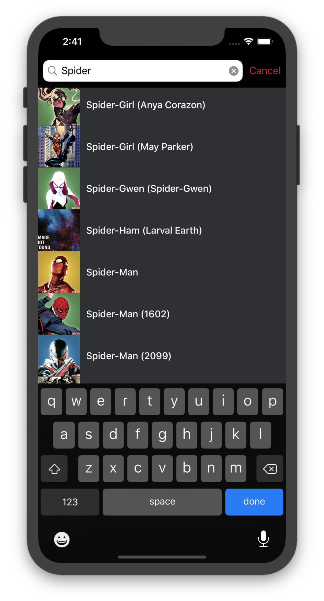
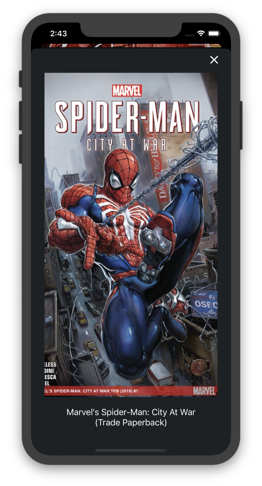

[//]: # "HTML"

<link rel="stylesheet" type="text/css" media="all" href="css/stylesheet.css"/>

[//]: # "Badges"

[![curriculum vitae][badge_downloadcv]][downloadCV]
[![email][badge_mailTo]][mailTo]
[![linkedIn][badge_linkedIn]][linkedIn]
[![twitter][badge_twiiter]][twiiter]
[![stackoverflow][badge_stackoverflow]][stackoverflow]

[//]: # "Projects"

# Marvel Characters

[![Dependency Injection][badge_carthage]][carthage]

[Marvel Characters](https://gitlab.com/hugoalonsoluis/marvel-characters) is a take-home project I completed as part of the interview process for an iOS Developer role. 

The prototype/design was provided as a [Marvel Prototype](https://marvelapp.com/279b309/screen/10499832). The main idea was to obtain and present data from the [Marvel API](https://developer.marvel.com).

I created a functional version in approximately 14 days using Swift 3, [RxSwift](https://github.com/ReactiveX/RxSwift) and Storyboards. It uses [Alamofire](https://github.com/Alamofire/Alamofire) for networking and [KingFisher](https://github.com/onevcat/Kingfisher) for caching of images.

This was the first time I used blur effects and custom transitions in an app, and I ❤️it!

Later on, I started experimenting with it and it has been my playground for testing and Continuous Integration using [GitlabCI](https://about.gitlab.com/product/continuous-integration/). Currently is updated to Swift 5.

<!-- Portfolio Gallery Grid -->

    

      

        
      

    

    

      

        
      

    

    

      

        
      

    

    

      

        
      

    

  

[//]: # " Images"

[marvelCharacters1]: ./images/marvel_characters_1.png

[//]: # "Badges"

[badge_carthage]: https://img.shields.io/badge/Dependency_Injection-Carthage-blue.svg?style=for-the-badge&logoColor=white
[badge_downloadCV]: https://img.shields.io/badge/Download_CV-black.svg?style=for-the-badge&logo=adobe&logoColor=white
[badge_mailTo]: https://img.shields.io/badge/Email-black.svg?style=for-the-badge&logo=minutemailer&logoColor=white
[badge_stackoverflow]: https://img.shields.io/badge/stackoverflow-black.svg?style=for-the-badge&logo=stackoverflow&logoColor=white
[badge_linkedIn]: https://img.shields.io/badge/linkedin-black.svg?style=for-the-badge&logo=linkedin&logoColor=white
[badge_twiiter]: https://img.shields.io/badge/twitter-black.svg?style=for-the-badge&logo=twitter&logoColor=white

[//]: # "Links"

[carthage]: https://github.com/Carthage/Carthage
[downloadCV]: /files/cv.pdf
[mailTo]: mailto:hugoalonsoluis@gmail.com
[stackoverflow]: https://stackoverflow.com/story/hugo-alonso-luis
[linkedIn]: https://www.linkedin.com/in/hugoalonsoluis/?locale=en_US
[twiiter]: https://twitter.com/hugoalonsoluis